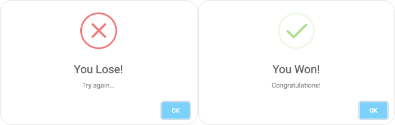

# Clicky Game 

The Toy Story Clicky Game is a memory game using React.

Please check out the launched app on Heroku [Here](https://infinite-reef-53648.herokuapp.com/)!

### Main Page 

## Instructions

To start the game, click in a random card. To earn points, click on a different character, however, do not click on a character more than once, or you will lose! 
The game will keep the track of the top score.

---
### Demo

OBS(the .gif decreased the quality on demo)

## Technical Details 

* Visual Studio Code
* [Bootstrap 3.3.7](https://getbootstrap.com/docs/3.3/)
* [Lodash](https://lodash.com/) 
* [Sweet Alert](https://sweetalert.js.org/guides/)